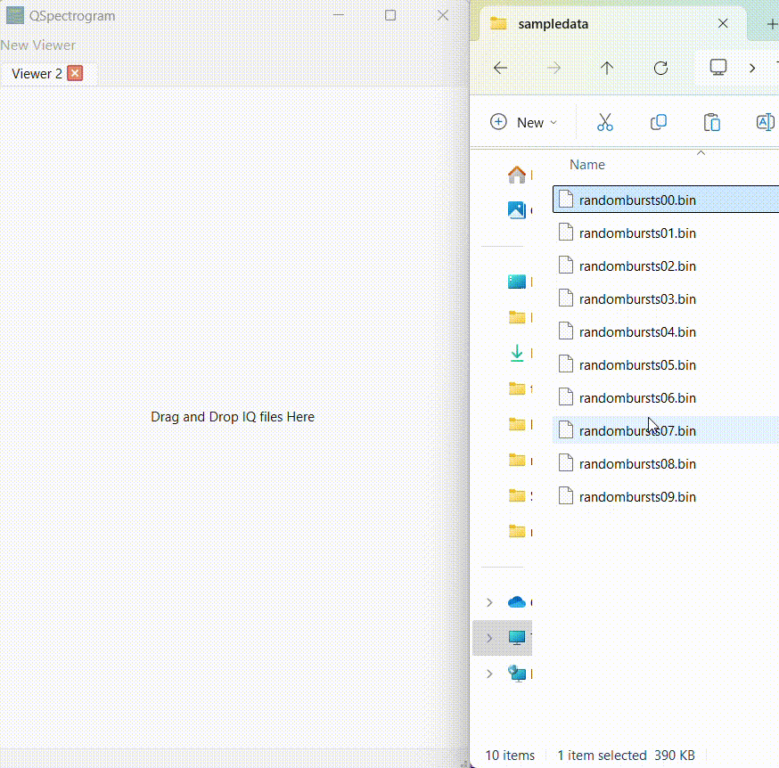
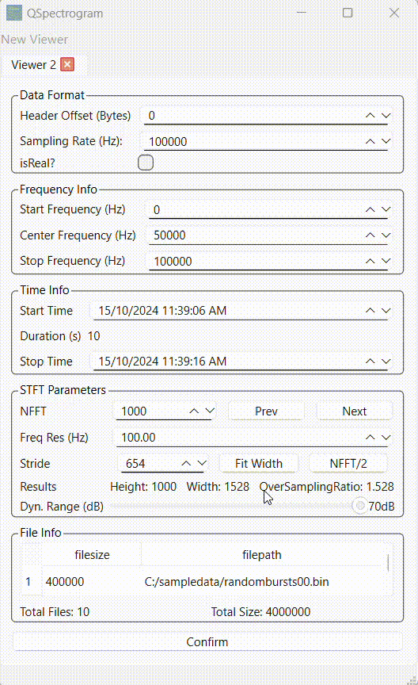
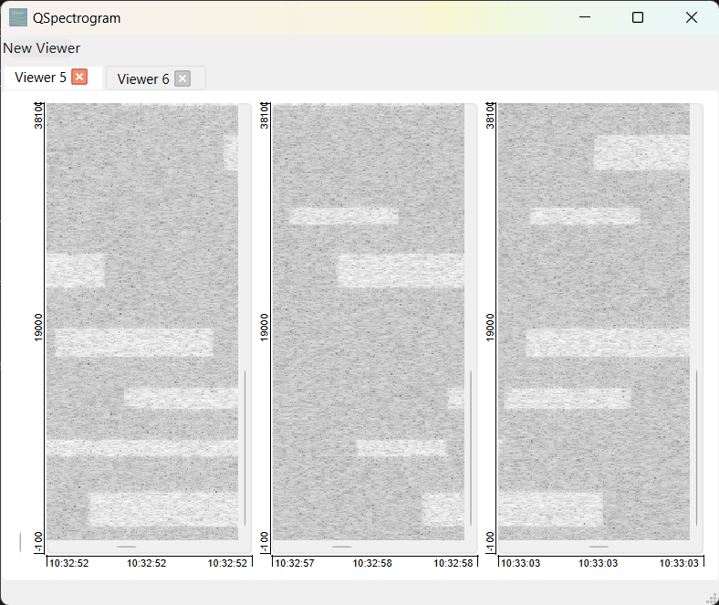

# QSpectrogram

RF signals are typically recorded and saved in a computer as binary files in int16 IQ format (or sometimes int16 real direct sampling format). Typically these recordings are visualized as a spectrogram using MATLAB / Python. However when the RF recording is large, these tools start to lag. QSpectrogram is created to provide fast, convenient and intuitive insights into large IQ files for RF engineers who regularly need to analyse their offline recordings.

## Screenshots
Using this tool is simple. Just click `New Viewer` > `1 Panel`. Drag and drop IQ files into the tool. 

Configure the recording and STFT parameters. Then click `Confirm` to view the spectrogram.

### Multipanel visualizations
Sometimes we may use multiple antennas to record the same time period. This feature allows synchronized comparison of the spectrogram across different recordings.

## Licensing
In compliance with Qt Licensing framework, this software is released as Open Source Software under LGPL. 